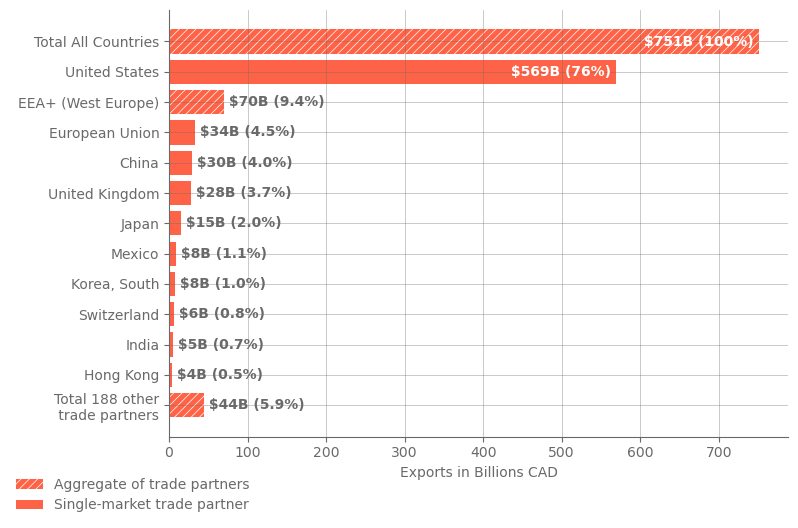

# The US-Canada Trade War: a prospectus (draft)

Author: Q.C. Xie | First published: 2025-03-xx | Last edited: 2025-03-xx

Why did Donald Trump start an unnecessary trade war with Canada? The consensus seems to be: for no good reason.

His formal justifications are nebulous, but hover around border security and the US trade deficit with Canada. These reasons, however, are either detached from reality or based on a flawed understanding of how bilateral trade works.

Canada's contribution to US border problem is negligeable. Less than xx% illegal migrants come from Canada. Less than 1% of fentaly in the US comes from Canada. [source] Almost a rounding error.

The trade deficit with Canada is dwarfed by those of other US trade partners like China and Germany. [source]

So why did he really start all this trouble? My pet theory is that he did not like being cuckolded by Justin Trudeau.

It goes back to a G7 summit in 2019, where a photo of Trudeau kissing Melania, with an oblivious Trump holding her hand, went viral. One French news outlet (of course) lead with the headline, ["Look of lust."](https://www.france24.com/en/20190827-papers-indonesia-names-new-capital-borneo-israel-lebanon-melania-trudeau-g7-photo)

The first daughter was not spared the Trudeau photo trap either. One viral tweeter wrote, ["Get someone that looks at you the way Ivanka Trump looks at Justin Trudeau,"](https://x.com/Phil_Lewis_/status/831280292379910144?t=EAPxWbPN6pyIdn-oeZOecQ&s=19) accompanying a snap of Ivanka gazing at the PM with a pondering hand on her chin.

Say what you will about Trudeau, but our boy is handsome. However ridiculous (and hilarious) these allegations or any other justification are, we now have a trade war.

Mark Carney, the new Prime Minister and leader of the Liberal Party replacing Trudeau, said after his election that [Canada "will win" the trade war.](https://www.bbc.com/news/articles/c36wkg47z1po.amp) Pierre Poilievre, leader of the main Conservatives opposition, also indicated [favoring a retaliatory response](https://youtube.com/shorts/4ZP7V5cxKPs?si=hMU9ef43AnjcC4nY) to US tariffs.

So how might this play out for Canadian industries and ? Let's first take a look at the current state of affairs between Canada and its main trade partners. Then we'll discuss how the proposed tariffs and counter-tariffs may influence Canada's trade patterns and the effect on jobs, wages, and prices.

## Canada's past trade patterns

<!-- 
Canada's top 10 <u>net</u> import partners (2024) | Canada's top 10 <u>net</u> export partners (2024)
:-------------------------:|:-------------------------:
  |  
 -->

To understand how Canada's trade balance might evolve under the tariffs, let's look back at the good old days of 2024--the most recent year of the pre-Trump trade regime.

In 2024, imports from the US totaled $360 billion, constituting about half of all $744 billion Canadian imports. Canadian imports from the entire [European Economic Area plus UK and Switzerland (EEA+)](https://www.gov.uk/eu-eea) totaled $103 billion, less than a third of US imports. After US, China is the next largest single country import partner to Canada at $88 billion.

About three-quarters of Canadian exports ($751 billion) went to the US ($569 billion), dwarfing EEA+'s $70 billion Canadian exports. The next largest single-country export partners are China and UK, importing a little less than $30 billion of Canadian exports each.

It's quite clear that Canada's trade activities are heavily reliant on the US. Not going to lie, the prognostication looks quite grim. But how bad will it be? Well let's see what the tariffs will be.

<!-- 

<figure>
    <figcaption align="center"><b>Canada's top 10 import partners (2024)</b></figcaption>
    
</figure>
<figure>
    <figcaption align="center"><b>Canada's top 10 export partners (2024)</b></figcaption>
    
</figure>

 -->

<!--
TODO:
* Descriptive figures of balance of payments by industry for Canada and main trade partners
* General equilibrium (SOE) model with tariffs
* DSGE (NOEM) model
-->